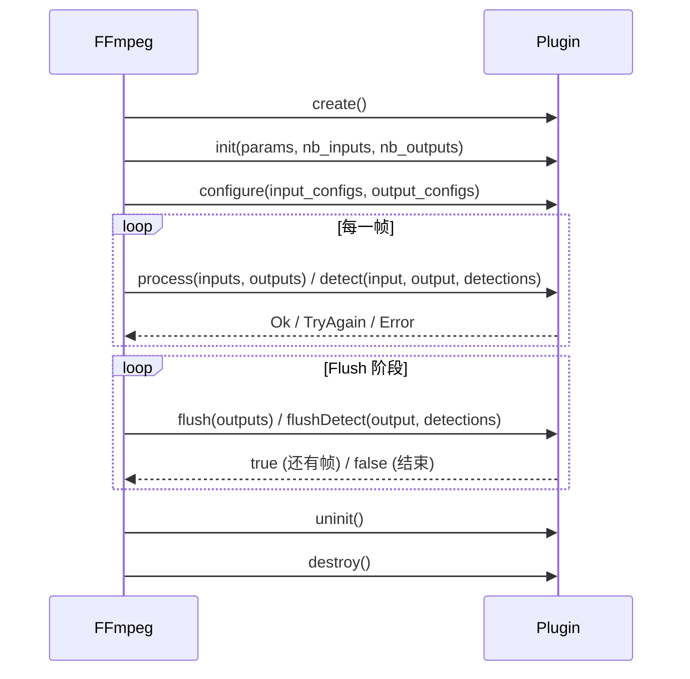

# FFmpeg + OpenCV：quink_oc_plugin 插件架构设计与实践

> **项目地址**: [avfilter-plugin](https://github.com/ffmpeg-plugin/avfilter-plugin)

---

## 一、背景：FFmpeg 的巨大价值与开发门槛

### 1.1 FFmpeg — 多媒体领域的基石

FFmpeg 是当今最强大、最广泛使用的开源多媒体处理框架。它支持几乎所有已知的音视频编解码器、封装格式和协议，被无数产品作为核心引擎。无论是视频转码、直播推流、缩略图生成，还是滤镜处理，FFmpeg 都是事实上的行业标准。

FFmpeg 的 **libavfilter** 子系统提供了丰富的视频/音频滤镜，覆盖了缩放、裁剪、去噪、色彩调整、叠加、字幕烧录等主流需求。通过 filter graph 语法（如 `-vf "scale=1280:720,fps=30"`），用户可以灵活地组合多个滤镜构建处理流水线。

### 1.2 难点：FFmpeg 开发门槛极高

然而，一旦用户需要 **添加自定义的视频处理逻辑**，FFmpeg 的优势就变成了障碍：

#### 编译难

- FFmpeg 使用 **自定义的 configure 构建系统**（非 autoconf），依赖复杂，交叉编译配置繁琐
- 完整构建需要几十个外部依赖库（x264、x265、libvpx、libopus……），配置选项多达数百个
- Windows 上通常需要 MSYS2/MinGW 环境，对新手极不友好
- 每次修改一个滤镜，都需要重新走完 configure → make 的完整流程

#### 加新功能难

- 编写一个新的 libavfilter 滤镜需要深入理解 FFmpeg 内部 API：`AVFrame`、`AVFilterLink`、`AVFilterFormats`、`FFFrameSync`、像素格式协商……
- 代码用C 语言编写，遵循 FFmpeg 严格的编码规范（命名风格、内存管理、错误处理）
- 新滤镜需要修改 FFmpeg 源码树中的 `allfilters.c`、`Makefile` 等多个文件
- 提交到 FFmpeg 上游的门槛极高，代码审核周期长

#### 对新手极不友好

- 一个 CV（计算机视觉）工程师可能精通 OpenCV、PyTorch，但完全不了解 `AVFrame` 的引用计数、像素格式协商、硬件帧上下文等 FFmpeg 概念
- 想要做一个简单的"对每帧跑一下人脸检测"，却需要先学习整个 libavfilter 架构
- **FFmpeg 和 OpenCV 之间缺少一个简洁的桥梁**

### 1.3 与 OpenCV 自带 FFmpeg 集成的对比

OpenCV 自身就集成了 FFmpeg 作为后端，通过 `cv::VideoCapture` 和 `cv::VideoWriter` 可以直接读写视频文件。那么，在 FFmpeg 里加 OpenCV 插件，和 OpenCV 自己调用 FFmpeg 有什么不同？

#### OpenCV 的 FFmpeg 集成：面向"读/写帧"的简单场景

OpenCV 调用 FFmpeg 的方式本质上是：**FFmpeg 作为 OpenCV 的 I/O 后端**。典型用法：

```cpp
cv::VideoCapture cap("input.mp4");   // FFmpeg 负责解封装 + 解码
cv::Mat frame;
while (cap.read(frame)) {
    // 用 OpenCV 处理每一帧
    cv::GaussianBlur(frame, frame, cv::Size(5, 5), 0);
}
cv::VideoWriter writer("output.mp4", ...);  // FFmpeg 负责编码 + 封装
```

这种模式适合 **简单的逐帧处理** 场景，但有明显的局限性：

- **无法利用 FFmpeg 的 filter graph** — 不能组合 FFmpeg 内置的 200+ 个滤镜（缩放、去隔行、字幕烧录、音视频同步……），只能用 OpenCV 自己重新实现
- **无法利用 FFmpeg 的硬件加速全流程** — `VideoCapture` 解码出来的帧是 CPU 内存中的 `cv::Mat`，即使底层解码器支持硬件加速，帧也必须经过 GPU → CPU 拷贝。无法实现 `nvdec → GPU 处理 → nvenc` 的全 GPU 路径
- **无法利用 FFmpeg 的复杂管线能力** — 多输入（画中画、拼接）、多输出（一路输入同时输出多种分辨率）、音视频同步处理等场景，在 OpenCV 中需要自己手动管理
- **与 FFmpeg 生态隔离** — FFmpeg 命令行、流媒体推拉（RTMP/SRT/HLS）、字幕处理、元数据操作等能力无法直接使用

#### quink_oc_plugin：面向"FFmpeg 管线中的自定义处理"场景

`quink_oc_plugin` 的思路恰好相反：**OpenCV 作为 FFmpeg 的处理后端**。你的处理逻辑作为 FFmpeg filter graph 中的一个节点，**嵌入到 FFmpeg 的完整管线中**：

```
输入 → 解封装 → 解码 → [FFmpeg 滤镜] → [你的 OpenCV 插件] → [FFmpeg 滤镜] → 编码 → 封装 → 输出
```

这带来了根本性的不同：

| | OpenCV 调用 FFmpeg | quink_oc_plugin |
|------|------|------|
| **谁是主控** | OpenCV 程序 | FFmpeg（命令行或 libav* API） |
| **FFmpeg 滤镜** | 无法使用 | 可以与任意 FFmpeg 滤镜组合 |
| **全 GPU 路径** |  帧必须到 CPU | nvdec → CUDA 插件 → nvenc，全程 GPU |
| **多输入/多输出** | 需手动管理 | FFmpeg 的 filter_complex 原生支持 |
| **流媒体** | 需自己实现 | FFmpeg 原生支持 RTMP/SRT/HLS 等 |
| **音频处理** | 需手动同步 | FFmpeg 自动处理音视频同步 |
| **适用场景** | 简单逐帧处理、快速原型 | 生产级转码管线、流媒体、复杂滤镜链 |

#### 两者互补，而非替代

这两种方式各有适用场景：

- **快速原型、简单逐帧处理** → 用 OpenCV 的 `VideoCapture`/`VideoWriter`，简单直接
- **生产级转码管线、需要利用 FFmpeg 全部能力** → 用 `quink_oc_plugin`，将 OpenCV 处理嵌入 FFmpeg 管线

`quink_oc_plugin` 的核心价值在于：让你既能享受 FFmpeg 作为多媒体引擎的全部能力（硬件加速、协议支持、滤镜组合），又能用 OpenCV 这个你最熟悉的工具来编写自定义处理逻辑。

### 1.4 我们需要什么？

我们需要一种方式，让开发者能够：

1. **不修改、不重新编译 FFmpeg** — 插件以动态库形式加载
2. **用 OpenCV API 写处理逻辑** — 输入是 `cv::Mat`，输出也是 `cv::Mat`
3. **零拷贝** — FFmpeg 的 `AVFrame` 和 OpenCV 的 `cv::Mat` 共享同一块内存
4. **支持 GPU 加速** — CUDA 插件直接操作 `cv::cuda::GpuMat`，全程不碰 CPU 内存
5. **支持复杂拓扑** — 多输入（如画面混合）、多输出（如画面分割）
6. **即插即用** — 写完 `.cpp`，编译成 `.so`/`.dll`，直接用 ffmpeg 命令行加载

这就是 **quink_oc_plugin** 要解决的问题。

---

## 二、整体架构设计

### 2.1 架构全景

```
┌─────────────────────────────────────────────────────────────┐
│                       FFmpeg Pipeline                       │
│                                                             │
│   input ──► [decoder] ──► [oc_plugin filter] ──► [encoder]  │
│                                  │                          │
│                       ┌──────────┴──────────┐               │
│                       │  vf_oc_plugin.cpp   │               │
│                       │    ( In FFmpeg)     │               │
│                       │                     │               │
│                       │  ┌────────────────┐ │               │
│                       │  │  FrameHandler  │ │               │
│                       │  └───────┬────────┘ │               │
│                       └──────────┼──────────┘               │
│                                  │ dlopen()                 │
│                       ┌──────────┴──────────┐               │
│                       │  Plugin (.so/.dll)  │               │
│                       │  quink_oc_plugin.h  │               │
│                       └─────────────────────┘               │
└─────────────────────────────────────────────────────────────┘
```

整个系统分为两层：

- **宿主层**（`vf_oc_plugin.cpp`）：编译进 FFmpeg，负责与 libavfilter 交互。处理帧分配、像素格式协商、framesync 多输入同步、CUDA 上下文管理、detection bbox 侧数据附加等所有 FFmpeg 内部细节。
- **插件层**（用户编写的 `.so`/`.dll`）：只依赖一个头文件 `quink_oc_plugin.h`，用 OpenCV API 实现处理逻辑。**不需要链接任何 FFmpeg 库**。

### 2.2 为什么选择 OpenCV 作为接口？

在设计插件 API 时，我们需要选择一种"数据载体"作为宿主和插件之间的数据交换格式。有以下几种选择：

| 方案 | 优点 | 缺点 |
|------|------|------|
| 裸指针 + 宽高步长 | 零依赖 | 插件需自行管理，不方便 |
| `AVFrame` | 原生 FFmpeg 类型 | 插件必须链接 FFmpeg，违背初衷 |
| **`cv::Mat` / `cv::cuda::GpuMat`** | **CV 开发者最熟悉的类型；OpenCV 生态丰富** | 需要 OpenCV 依赖 |
| 自定义 struct | 完全可控 | 又造了一个轮子 |

我们选择 OpenCV 的理由：

1. **目标用户就是 CV 开发者** — 他们日常工作就是用 `cv::Mat` 做图像处理、用 DNN 模块做推理。让他们直接操作熟悉的类型，学习成本为零。

2. **零拷贝可行** — `cv::Mat` 支持外部数据指针构造（不拥有数据），我们可以将 `AVFrame` 的缓冲区直接包装为 `cv::Mat`，反之亦然。通过自定义 `cv::MatAllocator`，我们**将 `cv::Mat` 的生命周期绑定到 `AVFrame` 的引用计数上**，实现真正的零拷贝。

3. **GPU 同样零拷贝** — `cv::cuda::GpuMat` 同样支持外部指针构造。FFmpeg 的 `AV_PIX_FMT_CUDA` 帧的 `data[0]` 就是 CUDA device pointer，直接包装为 `GpuMat` 即可，也可以打通引用计数。

4. **OpenCV 生态** — 2500+ 个函数，涵盖图像处理、特征提取、DNN 推理、CUDA 加速……插件可以直接调用这些函数，不需要重新造轮子。

### 2.3 三种插件类型

根据实际使用场景，我们定义了三种互斥的插件类型：

| 类型 | 基类 | 数据类型 | 应用场景 |
|------|------|----------|----------|
| **Process** | `quink::ProcessPlugin` | `cv::Mat` | CPU 帧变换：模糊、混合、分裂、缩放 |
| **CudaProcess** | `quink::CudaProcessPlugin` | `cv::cuda::GpuMat` | GPU 帧变换：全 GPU 转码流水线 |
| **Detect** | `quink::DetectPlugin` | `cv::Mat` | 目标检测：输出边界框作为侧数据 |

#### 为什么要区分 Process 和 Detect？

Process 插件可以修改帧内容（如模糊、混合），也可以改变输出分辨率。而 Detect 插件的核心诉求是 **分析帧并输出结构化数据**（边界框、类别、置信度），帧本身通常原样传递。将两者分开，可以让宿主自动处理 detection 结果到 `AV_FRAME_DATA_DETECTION_BBOXES` 侧数据的转换，插件只需要填充一个简单的 `Detections` 结构体即可。

#### 为什么要单独出 CudaProcess？

CUDA 插件和 CPU 插件的数据类型不同（`GpuMat` vs `Mat`），内存模型也不同（GPU 显存 vs CPU 内存）。此外，CUDA 插件需要接收一个 `cv::cuda::Stream` 参数以支持异步操作，宿主会在 `process()` 返回后自动同步 stream。将它作为独立类型，API 更清晰，类型安全更好。

### 2.4 I/O 拓扑支持

| 模式 | inputs | outputs | 示例 |
|------|--------|---------|------|
| **1:1** | 1 | 1 | 模糊、去噪、检测 |
| **N:1** | 2-8 | 1 | 画面混合、对比 |
| **1:N** | 1 | 2-8 | 画面分裂、多路分析 |
| **N:M** | >1 | >1 | ❌ 不支持 |

多输入模式（N:1）由 FFmpeg 内置的 `FFFrameSync` 机制处理帧同步，插件无需关心。多输出模式（1:N）中，宿主为每个输出预分配独立的帧缓冲区。

---

## 三、核心设计细节

### 3.1 零拷贝内存模型

这是整个架构的关键设计。

#### 输入帧：引用计数绑定

```cpp
// 宿主内部实现（简化）
class AVFrameMatAllocator : public cv::MatAllocator {
    void deallocate(cv::UMatData* u) const override {
        AVFrame* frame = static_cast<AVFrame*>(u->userdata);
        av_frame_free(&frame);  // Mat 释放时，AVFrame 引用计数 -1
    }
};
```

当宿主将 `AVFrame` 包装为 `cv::Mat` 时，通过自定义的 `MatAllocator` 将 `Mat` 的生命周期绑定到 `AVFrame` 的引用计数上。这意味着：

- `cv::Mat` 和 `AVFrame` **共享同一块内存**
- 插件可以安全地保存输入 `Mat` 的引用（例如用于时域缓冲），只要 `Mat` 还活着，底层的 `AVFrame` 缓冲区就不会被释放
- **不需要 `clone()`**：ref-counted 引用拷贝（`buffer_.push_back(inputs[0])`）就能同时保持像素数据和 AVFrame 元数据（时间戳、side data）存活
- 保存的输入 Mat 引用还可以用于 `ref_frame`，让输出帧获得正确的时间戳（详见第 3.6 节）
- 这对 GPU 帧同样适用：`GpuMat` 通过自定义 `Allocator` 绑定到 CUDA `AVFrame`

#### 输出帧：预分配临时视图

```cpp
// 宿主为插件预分配输出帧
AVFrame *out = ff_get_video_buffer(outlink, width, height);
cv::Mat output_mat(height, width, cv_type, out->data[0], out->linesize[0]);
// output_mat 是一个轻量级视图，没有引用计数
```

输出 `Mat` 只是 FFmpeg 预分配的 `AVFrame` 的一个轻量级视图（没有引用计数）。插件必须在 `process()` 返回前完成写入，**不能保存输出 `Mat` 的引用**。

| | 输入帧 | 输出帧 |
|------|--------|--------|
| 所有权 | 引用计数绑定到 AVFrame | FFmpeg 拥有，预分配 |
| 可保存引用？ | ✅ 安全 | ❌ 禁止 |
| 零拷贝？ | ✅ | ✅ |
| 用途 | 读取 + 缓冲 | 写入结果 |

#### 零拷贝传递（Pass-through）

对于不需要修改帧内容的场景（如 Detect 插件、Split 的第一路输出），CPU 插件可以直接：

```cpp
outputs[0].frame = inputs[0];  // 零拷贝：Mat 头部赋值，共享底层数据
```

宿主检测到输出 `Mat` 的 `data` 指针发生了变化（指向了输入帧的缓冲区），会自动处理引用计数转移，避免任何内存拷贝。

> **注意**：CUDA 插件不支持 pass-through（`outputs[0].frame = inputs[0]`），因为每个输出的 `GpuMat` 背后绑定了不同的 `hw_frames_ctx` 池。必须使用 `inputs[0].copyTo(outputs[0].frame, stream)` 实现 GPU 到 GPU 的拷贝。

### 3.2 宿主内部的策略模式

宿主使用 **Strategy 模式** 为三种插件类型实现不同的帧处理逻辑：

```cpp
class FrameHandler {                    // 抽象策略
    virtual int processFrame(...) = 0;
    virtual int processFrameMulti(...) = 0;
    virtual int flush() = 0;
};

class CpuFrameHandler : public FrameHandler { ... };    // CPU Process
class CudaFrameHandler : public FrameHandler { ... };   // CUDA Process
class DetectFrameHandler : public FrameHandler { ... };  // Detect
```

在插件加载时，宿主根据插件描述符中的 `capabilities` 字段选择对应的 Handler。之后所有帧处理调用都通过 Handler 的虚函数分发，主流程代码完全统一。

### 3.3 CUDA 上下文管理

对于 CUDA 插件，宿主负责所有 CUDA 上下文操作：

```cpp
class PushPopCudaCtx {
public:
    PushPopCudaCtx(AVCUDADeviceContext *hwctx) {
        cu->cuCtxPushCurrent(hwctx->cuda_ctx);  // 进入 CUDA 上下文
    }
    ~PushPopCudaCtx() {
        cu->cuCtxPopCurrent(&dummy);              // 离开 CUDA 上下文
    }
};
```

- 每次调用插件的 `process()` 前，宿主自动 push CUDA context
- `process()` 返回后，宿主自动 pop context
- 宿主从 FFmpeg 的 `AVCUDADeviceContext` 中获取 CUDA stream，包装为 `cv::cuda::Stream` 传给插件
- 插件的所有 GPU 操作都应该使用这个 stream，宿主在 `process()` 返回后会自动同步

**插件开发者完全不需要关心 CUDA context 的生命周期。**

### 3.4 像素格式协商

宿主在 `query_formats` 阶段向 FFmpeg 报告支持的像素格式：

- CPU 插件默认支持 `BGR24` 和 `BGRA`（OpenCV 的原生格式）
- CUDA 插件支持 `AV_PIX_FMT_CUDA`，底层的 `sw_format` 可以是 `NV12`、`P010`、`P016`、`BGR24`、`BGRA`

插件可以在 `configure()` 中修改输出格式。例如，CUDA 插件可以将 NV12 输入转换为 BGRA 输出：

```cpp
bool configure(const std::vector<quink::FrameConfig> &inputs,
               std::vector<quink::FrameConfig> &outputs) override {
    if (inputs[0].pix_fmt == quink::QPixelFormat::NV12) {
        outputs[0].pix_fmt = quink::QPixelFormat::BGRA;  // 告诉宿主输出是 BGRA
    }
    return true;
}
```

### 3.5 插件加载与 ABI 稳定性

插件通过 `dlopen()`（Linux/macOS）或 `LoadLibrary()`（Windows）动态加载。宿主查找的导出符号为：

```c
extern "C" const QuinkOCPluginDescriptor* quink_oc_plugin_get_descriptor();
```

`QuinkOCPluginDescriptor` 使用 **纯 C 类型**（`int`、`unsigned int`、函数指针）以确保 ABI 稳定性。`api_version` 字段用于版本兼容性检查。

```c
struct QuinkOCPluginDescriptor {
    int api_version;            // 必须等于 QUINK_OC_PLUGIN_API_VERSION
    const char *name;
    const char *description;
    unsigned int capabilities;  // quink::Capability 枚举的位掩码
    quink::PluginBase* (*create)();
    void (*destroy)(quink::PluginBase*);
};
```

三个便利宏 `QUINK_OC_PROCESS_PLUGIN_ENTRY`、`QUINK_OC_CUDA_PROCESS_PLUGIN_ENTRY`、`QUINK_OC_DETECT_PLUGIN_ENTRY` 自动生成上述描述符和导出函数，插件开发者只需一行代码完成注册。

### 3.6 Buffering、TryAgain/Flush 与时间戳关联（API v2）

并非所有滤镜都是逐帧处理的。时域滤镜（如帧平均、光流）需要缓冲多帧后才能输出。`oc_plugin` 通过 `ProcessResult::TryAgain` 和 `flush()` 机制原生支持这种模式：

```
Frame 1 → process() → TryAgain  (缓冲中，无输出)
Frame 2 → process() → TryAgain  (缓冲中，无输出)
Frame 3 → process() → Ok        (输出 avg(1,2,3)，ref_frame=frame1 → pts=frame1.pts)
Frame 4 → process() → Ok        (输出 avg(2,3,4)，ref_frame=frame2 → pts=frame2.pts)
...
EOF     → flush()   → true      (输出 avg(N-1,N)，ref_frame=frameN-1)
        → flush()   → true      (输出 avg(N)，ref_frame=frameN)
        → flush()   → false     (完成)
```

宿主在收到 `TryAgain` 时会自动释放预分配的输出帧（因为没有输出），在流结束时反复调用 `flush()` 直到返回 `false`。

#### 时间戳关联问题与 `ref_frame` 解决方案

在 API v1 中，当插件返回 `TryAgain` 后再返回 `Ok` 时，输出帧的时间戳总是来自**当次**的输入帧。例如，帧平均插件缓冲 3 帧后输出，输出帧的 pts 会错误地来自第 3 帧，而非图像数据对应的第 1 帧。

API v2 引入了 `OutputFrame<T>` 模板，每个输出帧可以通过 `ref_frame` 字段指定时间戳来源：

```cpp
quink::ProcessResult process(const std::vector<cv::Mat> &inputs,
                             std::vector<quink::ProcessOutput> &outputs) override {
    // 保存输入引用（不需要 clone，ref-counted 引用保持像素数据和 AVFrame 存活）
    buffer_.push_back(inputs[0]);

    if (buffer_.size() < N)
        return quink::ProcessResult::TryAgain;

    computeAverage(buffer_, outputs[0].frame);
    outputs[0].ref_frame = buffer_.front();  // ★ 使用第一帧的时间戳
    buffer_.pop_front();
    return quink::ProcessResult::Ok;
}
```

**关键要点**：

- `ref_frame` 为空（默认）时，自动使用当前输入帧的时间戳，**完全向后兼容**
- 输入 Mat 是 ref-counted 的，`push_back(inputs[0])` 就够了，不需要 `clone()`
- 不要用 `clone()` 出来的 Mat 作为 `ref_frame`，因为 clone 会丢失内部的 AVFrame 绑定
- CUDA 插件使用 `CudaProcessOutput`，`ref_frame` 机制完全相同

---

## 四、CUDA 插件与全 GPU 流水线

### 4.1 CUDA 插件的核心价值

CUDA 插件的真正价值不仅仅是"用 GPU 加速一个滤镜"，而是实现 **全 GPU 转码流水线**：

```
硬件解码 (nvdec) → CUDA 插件处理 → 硬件编码 (nvenc)
```

在这条路径上，视频帧从解码到编码全程在 GPU 显存中，**从不经过 CPU 内存**。这是 CUDA 插件相比 CPU 插件的根本性优势 — 如果帧要从 GPU 下载到 CPU 再处理再上传回 GPU，那瓶颈就在 PCIe 传输，GPU 计算的速度优势会被抵消。

```bash
# 全 GPU 流水线：硬件解码 → CUDA 插件 → 硬件编码
ffmpeg -hwaccel cuda -hwaccel_output_format cuda -i input.mp4 \
    -vf "oc_plugin=plugin=./libcuda_blur_plugin.so:params='ksize=15'" \
    -c:v hevc_nvenc -b:v 2M -c:a copy output.mp4
```

### 4.2 NV12/P016 格式处理 — 关键难点

在全 GPU 流水线中，硬件解码器输出的帧格式通常是 **NV12**（8 位）或 **P016**（10/16 位），而非 RGB/BGRA。这是 CUDA 插件开发中最重要的技术挑战。

#### NV12 GpuMat 内存布局

宿主将 NV12 帧包装为一个 **高度 × 1.5** 的单通道 GpuMat：

```
┌───────────────────────┐
│        Y              │  height 行, width 列, CV_8UC1
│                       │
├───────────────────────┤
│       UV              │  height/2 行, width 列, 交错 U/V
│                       │
└───────────────────────┘
 总计: height × 1.5 行 × width 列
```

大多数 OpenCV CUDA 函数（滤镜、混合等）期望 BGRA（`CV_8UC4`）输入，因此 **插件必须在 GPU 上完成 NV12 → BGRA 的色彩空间转换**。

#### 转换方案

使用 OpenCV `cudacodec` 模块的 `cv::cudacodec::createNVSurfaceToColorConverter`：

```cpp
convert_ = cv::cudacodec::createNVSurfaceToColorConverter(
    static_cast<cv::cudacodec::ColorSpaceStandard>(in.colorspace),
    !in.limited_range);
```

> ⚠️ 这个函数设计上是要处理 BT.601/BT.709/BT.2020 色彩空间标准和 limited/full range 的差异，但是我测试过程中发现处理BT.2020有bug，已提交PR到opencv_contrib: [opencv_contrib PR 4076](https://github.com/opencv/opencv_contrib/pull/4076)

> ⚠️ **不要使用 `cv::cuda::cvtColor(COLOR_YUV2BGRA_NV12)`** — OpenCV CUDA 暂时不支持这个转换码 (2026-02-09)。

#### 关键技巧：只需正向转换

插件不需要将 BGRA 转回 NV12。在 `configure()` 中设置：

```cpp
outputs[0].pix_fmt = quink::QPixelFormat::BGRA;
```

告诉宿主输出格式是 BGRA。宿主会分配 BGRA 格式的输出缓冲区，而硬件编码器（如 `hevc_nvenc`）可以直接接受 BGRA 输入。

---

## 五、如何实现自己的插件

### 5.1 项目结构

参考 demo 项目 `ffmpeg_oc_plugins` 的目录结构：

```
ffmpeg_oc_plugins/
├── CMakeLists.txt              # 顶层构建配置
├── include/
│   └── quink_oc_plugin.h       # SDK 头文件（除OpenCV之外的唯一依赖）
├── src/
│   ├── CMakeLists.txt          # 插件构建 + 测试配置
│   ├── plugin_common.h         # Demo 插件共享的参数解析工具
│   ├── blur_plugin.cpp         # CPU 模糊插件 (1:1)
│   ├── blend_plugin.cpp        # CPU 混合插件 (N:1)
│   ├── split_plugin.cpp        # CPU 分裂插件 (1:N)
│   ├── avgframes_plugin.cpp    # CPU 帧平均插件 (TryAgain/Flush)
│   ├── detect_plugin.cpp       # 目标检测插件
│   ├── cuda_blur_plugin.cpp    # CUDA 模糊插件
│   ├── cuda_blend_plugin.cpp   # CUDA 混合插件
│   ├── cuda_split_plugin.cpp   # CUDA 分裂插件
│   └── verify_output.cmake     # 测试验证脚本
└── docs/
    └── plugin_api.md           # API 详细文档
```

### 5.2 构建配置

顶层 `CMakeLists.txt` 将 SDK 定义为 header-only interface library：

```cmake
add_library(quink_oc_plugin INTERFACE)
target_include_directories(quink_oc_plugin INTERFACE include)
```

每个插件就是一个动态库：

```cmake
macro(add_plugin name)
    add_library(${name}_plugin SHARED ${name}_plugin.cpp)
    target_link_libraries(${name}_plugin PRIVATE quink_oc_plugin ${OpenCV_LIBS})
    set_target_properties(${name}_plugin PROPERTIES PREFIX "lib")
endmacro()

add_plugin(blur)
add_plugin(blend)
```

构建和测试：

```bash
cmake -B build -DFFMPEG_CMD=/path/to/ffmpeg
cmake --build build
ctest --test-dir build --output-on-failure
```

### 5.3 示例一：最简 CPU 插件 — 高斯模糊 (1:1)

这是最简单的插件形式 — 一帧输入，一帧输出：

```cpp
#include <opencv2/imgproc.hpp>
#include "quink_oc_plugin.h"

class GaussianBlurPlugin : public quink::ProcessPlugin {
public:
    bool init(const char *params, int nb_inputs, int nb_outputs) override {
        if (nb_inputs != 1 || nb_outputs != 1)
            return false;
        // 解析参数，如 "ksize=15"
        if (params) {
            const char *p = strstr(params, "ksize=");
            if (p) ksize_ = atoi(p + 6) | 1;  // 确保奇数
        }
        return true;
    }

    void uninit() override {}

    bool configure(const std::vector<quink::FrameConfig> &inputs,
                   std::vector<quink::FrameConfig> &outputs) override {
        // 输出尺寸与输入相同（默认），不需要修改
        return true;
    }

    quink::ProcessResult process(const std::vector<cv::Mat> &inputs,
                                 std::vector<quink::ProcessOutput> &outputs) override {
        cv::GaussianBlur(inputs[0], outputs[0].frame,
                         cv::Size(ksize_, ksize_), 0);
        return quink::ProcessResult::Ok;
    }

    bool flush(std::vector<quink::ProcessOutput> &) override { return false; }

private:
    int ksize_ = 5;
};

// 一行代码完成注册
QUINK_OC_PROCESS_PLUGIN_ENTRY(GaussianBlurPlugin, "blur", "Gaussian blur effect")
```

使用方式：

```bash
ffmpeg -i input.mp4 \
    -vf "oc_plugin=plugin=./libblur_plugin.so:params='ksize=15'" \
    output.mp4
```

**就这么简单。** 不需要理解 `AVFrame`，不需要像素格式协商，不需要链接 FFmpeg — 只需要 OpenCV 的 `GaussianBlur` 和一个宏。

### 5.4 示例二：多输入混合插件 (N:1)

将两路视频按 alpha 比例混合：

```cpp
class AlphaBlendPlugin : public quink::ProcessPlugin {
public:
    bool init(const char *params, int nb_inputs, int nb_outputs) override {
        if (nb_inputs != 2 || nb_outputs != 1)
            return false;
        if (params) {
            const char *p = strstr(params, "alpha=");
            if (p) alpha_ = atof(p + 6);
        }
        return true;
    }

    quink::ProcessResult process(const std::vector<cv::Mat> &inputs,
                                 std::vector<quink::ProcessOutput> &outputs) override {
        cv::addWeighted(inputs[0], 1.0 - alpha_, inputs[1], alpha_, 0.0, outputs[0].frame);
        return quink::ProcessResult::Ok;
    }

    // ... configure, flush, uninit 省略（同上）

private:
    double alpha_ = 0.5;
};

QUINK_OC_PROCESS_PLUGIN_ENTRY(AlphaBlendPlugin, "blend", "Alpha blend two streams")
```

使用方式（注意 `inputs=2`）：

```bash
ffmpeg -i bg.mp4 -i fg.mp4 \
    -filter_complex "[0:v][1:v]oc_plugin=plugin=./libblend_plugin.so:inputs=2:params='alpha=0.3'" \
    output.mp4
```

多路输入的帧同步由 FFmpeg 的 `FFFrameSync` 自动处理，插件 `process()` 被调用时，`inputs[0]` 和 `inputs[1]` 已经是时间对齐的帧。

### 5.5 示例三：多输出split插件 (1:N)

一路输入，同时输出原始画面、灰度画面和边缘检测画面：

```cpp
class SplitPlugin : public quink::ProcessPlugin {
public:
    bool init(const char *params, int nb_inputs, int nb_outputs) override {
        if (nb_inputs != 1 || nb_outputs < 1) return false;
        num_outputs_ = nb_outputs;
        return true;
    }

    quink::ProcessResult process(const std::vector<cv::Mat> &inputs,
                                 std::vector<quink::ProcessOutput> &outputs) override {
        const cv::Mat &src = inputs[0];

        outputs[0].frame = src;  // 零拷贝传递

        if (num_outputs_ >= 2) {
            cv::Mat gray;
            cv::cvtColor(src, gray, cv::COLOR_BGR2GRAY);
            cv::cvtColor(gray, outputs[1].frame, cv::COLOR_GRAY2BGR);
        }

        if (num_outputs_ >= 3) {
            cv::Mat gray, edges;
            cv::cvtColor(src, gray, cv::COLOR_BGR2GRAY);
            cv::Canny(gray, edges, 50, 150);
            cv::cvtColor(edges, outputs[2].frame, cv::COLOR_GRAY2BGR);
        }

        return quink::ProcessResult::Ok;
    }

    // ... 省略 configure, flush, uninit
};

QUINK_OC_PROCESS_PLUGIN_ENTRY(SplitPlugin, "split", "Single input to multiple outputs")
```

使用方式：

```bash
ffmpeg -i input.mp4 \
    -filter_complex "oc_plugin=plugin=./libsplit_plugin.so:outputs=3[out0][out1][out2]" \
    -map "[out0]" pass.mp4 -map "[out1]" gray.mp4 -map "[out2]" edges.mp4
```

### 5.6 示例四：帧缓冲插件 — TryAgain/Flush 与 ref_frame

帧平均插件：缓冲 N 帧后输出它们的平均值，展示了 `TryAgain`、`flush()` 和 `ref_frame` 时间戳关联的完整用法：

```cpp
class FrameAveragePlugin : public quink::ProcessPlugin {
public:
    bool init(const char *params, int nb_inputs, int nb_outputs) override {
        if (nb_inputs != 1 || nb_outputs != 1) return false;
        if (params) {
            const char *p = strstr(params, "frames=");
            if (p) num_frames_ = std::clamp(atoi(p + 7), 1, 16);
        }
        return true;
    }

    quink::ProcessResult process(const std::vector<cv::Mat> &inputs,
                                 std::vector<quink::ProcessOutput> &outputs) override {
        // 保存输入引用（不需要 clone！ref-counted 引用保持像素数据和 AVFrame 存活）
        buffer_.push_back(inputs[0]);

        if (static_cast<int>(buffer_.size()) < num_frames_)
            return quink::ProcessResult::TryAgain;  // 帧不够，继续缓冲

        computeAverage(outputs[0].frame);
        // ★ 使用最早缓冲帧的时间戳
        outputs[0].ref_frame = buffer_.front();
        buffer_.pop_front();
        return quink::ProcessResult::Ok;
    }

    bool flush(std::vector<quink::ProcessOutput> &outputs) override {
        if (buffer_.empty()) return false;
        computeAverage(outputs[0].frame);
        // ★ flush 中同样使用 ref_frame
        outputs[0].ref_frame = buffer_.front();
        buffer_.pop_front();
        return true;  // 还有更多帧需要输出
    }

    void uninit() override { buffer_.clear(); }

private:
    void computeAverage(cv::Mat &output) {
        cv::Mat acc;
        buffer_[0].convertTo(acc, CV_32F);
        for (size_t i = 1; i < buffer_.size(); i++) {
            cv::Mat tmp;
            buffer_[i].convertTo(tmp, CV_32F);
            acc += tmp;
        }
        acc /= static_cast<double>(buffer_.size());
        acc.convertTo(output, buffer_[0].type());
    }

    int num_frames_ = 3;
    std::deque<cv::Mat> buffer_;  // Ref-counted 输入 Mat（像素数据 + 时间戳）
};
```

**关键变化（相比 API v1）**：

1. **不需要 `clone()`**：`buffer_.push_back(inputs[0])` 就够了。输入 Mat 是 ref-counted 的，保存引用就能保持像素数据和 AVFrame 元数据存活
2. **`ref_frame` 传递时间戳**：`outputs[0].ref_frame = buffer_.front()` 让 FFmpeg 使用第一帧的 pts，而非当前帧的 pts
3. **如果不设 `ref_frame`（默认为空）**：自动回退到当前输入帧的时间戳，完全向后兼容

### 5.7 示例五：目标检测插件

检测插件分析帧内容，输出结构化的边界框数据：

```cpp
class DemoDetectPlugin : public quink::DetectPlugin {
public:
    bool init(const char *params, int nb_inputs, int nb_outputs) override {
        return nb_inputs == 1 && nb_outputs == 1;  // Detect 始终是 1:1
    }

    quink::ProcessResult detect(const cv::Mat &input, cv::Mat &output,
                                quink::Detections &detections) override {
        output = input;  // 零拷贝传递原始帧

        cv::Mat hsv;
        cv::cvtColor(input, hsv, cv::COLOR_BGR2HSV);

        // 查找红色区域
        cv::Mat mask;
        cv::inRange(hsv, cv::Scalar(0, 100, 100), cv::Scalar(10, 255, 255), mask);

        std::vector<std::vector<cv::Point>> contours;
        cv::findContours(mask, contours, cv::RETR_EXTERNAL, cv::CHAIN_APPROX_SIMPLE);

        for (const auto &c : contours) {
            if (cv::contourArea(c) < 500) continue;
            cv::Rect box = cv::boundingRect(c);
            float confidence = std::min(1.0f, static_cast<float>(cv::contourArea(c)) / 10000.0f);
            detections.add(box, /*class_id=*/0, confidence, "red");
        }

        return quink::ProcessResult::Ok;
    }

    bool flushDetect(cv::Mat &, quink::Detections &) override { return false; }
    void uninit() override {}
};

QUINK_OC_DETECT_PLUGIN_ENTRY(DemoDetectPlugin, "demo_detect", "Demo color detection")
```

宿主会自动将 `detections` 转换为 FFmpeg 的 `AV_FRAME_DATA_DETECTION_BBOXES` 侧数据，下游滤镜或工具可以直接消费。

### 5.8 示例六：CUDA 模糊插件 — 全 GPU 流水线

展示完整的 NV12 → BGRA 转换和 GPU 处理：

```cpp
#include <opencv2/cudacodec.hpp>
#include <opencv2/cudafilters.hpp>

class CudaGaussianBlurPlugin : public quink::CudaProcessPlugin {
public:
    bool init(const char *params, int nb_inputs, int nb_outputs) override {
        if (nb_inputs != 1 || nb_outputs != 1) return false;
        if (params) {
            const char *p = strstr(params, "ksize=");
            if (p) ksize_ = atoi(p + 6) | 1;
        }
        return true;
    }

    bool configure(const std::vector<quink::FrameConfig> &inputs,
                   std::vector<quink::FrameConfig> &outputs) override {
        const quink::FrameConfig &in = inputs[0];
        quink::FrameConfig &out = outputs[0];

        if (in.pix_fmt == quink::QPixelFormat::NV12 ||
            in.pix_fmt == quink::QPixelFormat::P016) {
            // ★ 关键：告诉宿主输出格式是 BGRA
            out.pix_fmt = quink::QPixelFormat::BGRA;

            auto sf = (in.pix_fmt == quink::QPixelFormat::NV12)
                ? cv::cudacodec::SF_NV12 : cv::cudacodec::SF_P016;

            // 创建 GPU 色彩转换器，正确处理色彩空间和范围
            convert_ = cv::cudacodec::createNVSurfaceToColorConverter(
                static_cast<cv::cudacodec::ColorSpaceStandard>(in.colorspace),
                !in.limited_range);

            blur_ = cv::cuda::createGaussianFilter(CV_8UC4, CV_8UC4,
                        cv::Size(ksize_, ksize_), 0);
        } else {
            out.pix_fmt = in.pix_fmt;
            blur_ = cv::cuda::createGaussianFilter(in.cv_type, in.cv_type,
                        cv::Size(ksize_, ksize_), 0);
        }
        return true;
    }

    quink::ProcessResult process(const std::vector<cv::cuda::GpuMat> &inputs,
                                 std::vector<quink::CudaProcessOutput> &outputs,
                                 cv::cuda::Stream &stream) override {
        cv::cuda::GpuMat in = inputs[0];

        if (convert_) {
            cv::cuda::GpuMat bgra;
            convert_->convert(in, bgra, surface_format_,
                              cv::cudacodec::BGRA, cv::cudacodec::EIGHT,
                              false, stream);
            in = bgra;
        }

        blur_->apply(in, outputs[0].frame, stream);
        return quink::ProcessResult::Ok;
    }

    bool flush(std::vector<quink::CudaProcessOutput> &, cv::cuda::Stream &) override {
        return false;
    }

    void uninit() override { blur_.release(); }

private:
    int ksize_ = 5;
    cv::Ptr<cv::cuda::Filter> blur_;
    cv::cudacodec::SurfaceFormat surface_format_ = cv::cudacodec::SF_NV12;
    cv::Ptr<cv::cudacodec::NVSurfaceToColorConverter> convert_;
};

QUINK_OC_CUDA_PROCESS_PLUGIN_ENTRY(CudaGaussianBlurPlugin, "cuda_blur", "CUDA Gaussian blur")
```

使用方式：

```bash
# 全 GPU 流水线（推荐）
ffmpeg -hwaccel cuda -hwaccel_output_format cuda -i input.mp4 \
    -vf "oc_plugin=plugin=./libcuda_blur_plugin.so:params='ksize=15'" \
    -c:v hevc_nvenc -b:v 2M output.mp4

# 测试用：CPU 解码 → 上传 GPU → 插件 → 下载 CPU → CPU 编码
ffmpeg -i input.mp4 \
    -vf "format=bgra,hwupload_cuda,oc_plugin=plugin=./libcuda_blur_plugin.so:params='ksize=15',hwdownload,format=bgra" \
    output.mp4
```

---

## 六、插件生命周期

完整的生命周期如下图所示：



关键点：

1. `create()` 和 `destroy()` 是描述符中的工厂函数，由宏自动生成
2. `init()` 用于解析参数和验证 I/O 配置
3. `configure()` 在 FFmpeg filter graph 配置阶段调用，此时分辨率和像素格式已确定
4. `process()`/`detect()` 在每帧（或每组帧）到达时调用
5. `flush()` 在流结束时反复调用直到返回 `false`
6. `uninit()` 在 filter graph 销毁时调用，释放所有资源

---

## 七、测试与调试

### 7.1 CTest 集成

项目使用 CMake 的 CTest 框架进行自动化测试，每个插件都有对应的测试用例：

```bash
cmake -B build -DFFMPEG_CMD=/path/to/ffmpeg
cmake --build build
ctest --test-dir build --output-on-failure
```

测试会自动：
- 使用 FFmpeg 的 lavfi testsrc 生成测试视频（不需要外部视频文件）
- 运行插件处理
- 验证输出文件大小、framemd5 一致性
- 对比参考输出（确认滤镜确实产生了效果）

### 7.2 Valgrind 内存检查

```bash
ctest --test-dir build -T memcheck \
    --overwrite MemoryCheckCommand=/usr/bin/valgrind \
    --overwrite MemoryCheckCommandOptions="--leak-check=full --track-origins=yes --error-exitcode=1"
```

### 7.3 AddressSanitizer

```bash
cmake -B build \
    -DCMAKE_CXX_FLAGS="-fsanitize=address -fno-omit-frame-pointer" \
    -DCMAKE_C_FLAGS="-fsanitize=address -fno-omit-frame-pointer" \
    -DCMAKE_EXE_LINKER_FLAGS="-fsanitize=address" \
    -DCMAKE_SHARED_LINKER_FLAGS="-fsanitize=address"
cmake --build build
ctest --test-dir build --output-on-failure
```

### 7.4 NVIDIA Compute Sanitizer（CUDA 插件）

```bash
compute-sanitizer --tool memcheck \
    ./ffmpeg -hwaccel cuda -hwaccel_output_format cuda -i input.mp4 \
    -vf "oc_plugin=plugin=./libcuda_blur_plugin.so:params=ksize=15" \
    -c:v hevc_nvenc -b:v 2M output.mp4
```

---

## 八、获取与编译

### 8.1 源码仓库

带有 `vf_oc_plugin` 的 FFmpeg 源码托管在：

- **FFmpeg（含 oc_plugin）**: [https://github.com/ffmpeg-plugin/FFmpeg](https://github.com/ffmpeg-plugin/FFmpeg)
- **Demo 插件**: [https://github.com/ffmpeg-plugin/avfilter-plugin](https://github.com/ffmpeg-plugin/avfilter-plugin)

### 8.2 macOS / Linux 编译

在 macOS 和 Linux 上，可以从源码编译 FFmpeg 并启用 OpenCV 支持：

```bash
# 1. 克隆源码
git clone https://github.com/ffmpeg-plugin/FFmpeg.git
cd FFmpeg

# 2. 配置（启用 libopencv）
./configure --enable-libopencv \
    --extra-cxxflags="$(pkg-config --cflags opencv4)" \
    --extra-ldflags="$(pkg-config --libs opencv4)"

# 3. 编译
make -j$(nproc)

# 4. 安装（可选）
sudo make install
```

> **提示**：`--enable-libopencv` 是必需的，它会编译 `vf_oc_plugin` 滤镜。确保系统已安装 OpenCV 4.x 开发库（通过 `apt install libopencv-dev`、`brew install opencv` 或源码编译均可）。

### 8.3 Windows 预编译版本

对于 Windows 用户，可以直接下载预编译的 FFmpeg（含 oc_plugin 支持）：

- **下载地址**: [https://github.com/ffmpeg-plugin/FFmpeg/releases/tag/v0.01](https://github.com/ffmpeg-plugin/FFmpeg/releases/tag/v0.01)

下载后解压即可使用，无需编译 FFmpeg。只需要编译你自己的插件 `.dll` 即可。

### 8.4 编译 Demo 插件

无论使用哪种方式获取 FFmpeg，Demo 插件的编译方式相同：

```bash
git clone https://github.com/ffmpeg-plugin/avfilter-plugin.git
cd avfilter-plugin
cmake -B build -DFFMPEG_CMD=/path/to/ffmpeg
cmake --build build
ctest --test-dir build --output-on-failure
```

Windows端让cmake找到vcpkg构建的opencv package，可以使用：
```
cmake -B build -DFFMPEG_CMD=/path/to/ffmpeg \
    -DCMAKE_TOOLCHAIN_FILE=${VCPKG_ROOT}/scripts/buildsystems/vcpkg.cmake
```

### 8.5 项目状态

> ⚠️ **当前项目处于开发阶段（Development）**，API 可能会有变化。

关于是否提交到 FFmpeg 上游社区：FFmpeg 社区对于是否支持插件化架构一直存在争议，因此目前暂不考虑上游提交。计划在 **FFmpeg 8.1 发布后**，基于 FFmpeg 8.1 发布一个正式的 release 版本。

---

## 九、总结与展望

`quink_oc_plugin` 通过插件架构，在 FFmpeg 强大的多媒体处理能力和 OpenCV 丰富的计算机视觉生态之间搭建了一座桥梁。

**核心设计理念**：

| 设计目标 | 实现方式 |
|----------|----------|
| 零拷贝 | 自定义 MatAllocator 绑定 AVFrame 引用计数 |
| Header-only SDK | 插件只需一个 `.h` 文件，不链接 FFmpeg |
| 动态加载 | dlopen/LoadLibrary，运行时加载 |
| 全 GPU 路径 | CUDA 插件直接操作 GpuMat，宿主管理 CUDA context |
| 灵活拓扑 | 支持 1:1、N:1、1:N 三种 I/O 模式 |
| 帧缓冲 | TryAgain/Flush 原生支持时域滤镜 |
| 跨平台 | Linux、macOS、Windows |

对于 CV 开发者来说，只需要：

1. 继承一个基类
2. 实现 `init()`、`configure()`、`process()`、`flush()`、`uninit()`
3. 用一个宏注册
4. 编译为 `.so`
5. `ffmpeg …… -vf "oc_plugin=plugin=./your_plugin.so" ……` — Done!
