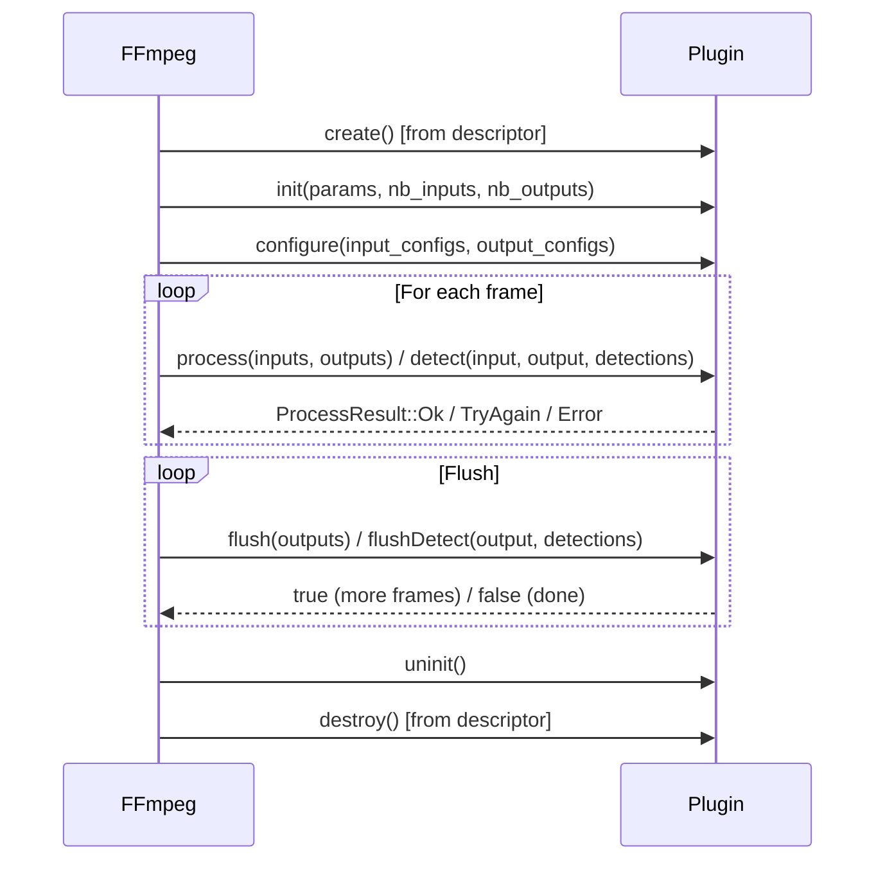

# FFmpeg OpenCV Plugin API Documentation

## Table of Contents

- [Design Overview](#design-overview)
- [Architecture](#architecture)
- [Plugin Types](#plugin-types)
- [API Reference](#api-reference)
  - [Common Types](#common-types)
  - [PluginBase](#pluginbase)
  - [ProcessPlugin](#processplugin)
  - [CudaProcessPlugin](#cudaprocessplugin)
  - [DetectPlugin](#detectplugin)
  - [Plugin Descriptor](#plugin-descriptor)
  - [Entry Macros](#entry-macros)
- [Memory Model & Ownership Rules](#memory-model--ownership-rules)
- [Plugin Lifecycle](#plugin-lifecycle)
- [How to Implement Your Own Plugin](#how-to-implement-your-own-plugin)
  - [Step 1: Choose Plugin Type](#step-1-choose-plugin-type)
  - [Step 2: Implement the Plugin Class](#step-2-implement-the-plugin-class)
  - [Step 3: Register with Entry Macro](#step-3-register-with-entry-macro)
  - [Step 4: Build as Shared Library](#step-4-build-as-shared-library)
  - [Step 5: Test with FFmpeg](#step-5-test-with-ffmpeg)
- [Examples](#examples)
  - [Minimal 1:1 Process Plugin](#minimal-11-process-plugin)
  - [Multi-Input Blend Plugin (N:1)](#multi-input-blend-plugin-n1)
  - [Multi-Output Split Plugin (1:N)](#multi-output-split-plugin-1n)
  - [Buffered Plugin with TryAgain/Flush](#buffered-plugin-with-tryagainflush)
  - [Detect Plugin](#detect-plugin)
  - [CUDA Process Plugin](#cuda-process-plugin)
- [Supported Pixel Formats](#supported-pixel-formats)
- [I/O Mode Summary](#io-mode-summary)

---

## Design Overview

The `oc_plugin` filter provides a **plugin-based architecture** for FFmpeg's libavfilter, allowing users to write video processing plugins using the OpenCV API without modifying or recompiling FFmpeg itself.

### Key Design Goals

1. **Zero-copy data exchange**: Plugin inputs/outputs are backed by AVFrame buffers — no unnecessary memory copies between FFmpeg and OpenCV.
2. **Header-only SDK**: The entire plugin interface is defined in a single header `quink_oc_plugin.h`. No link-time dependency on FFmpeg libraries.
3. **Dynamic loading**: Plugins are loaded at runtime via `dlopen`/`LoadLibrary`, enabling independent development and deployment.
4. **Three plugin types**: Process (CPU), CudaProcess (GPU), and Detect — covering the most common video filter use cases.
5. **Flexible I/O topology**: Supports 1:1, N:1 (multi-input), and 1:N (multi-output) modes.
6. **Cross-platform**: Works on Linux, macOS, and Windows.

### What the Host (FFmpeg) Handles

- Frame allocation and lifecycle management
- Pixel format negotiation and conversion
- Multi-input frame synchronization (via FFmpeg's framesync)
- CUDA context management (push/pop, stream synchronization)
- Detection result attachment as AVFrame side data
- Plugin loading, version checking, and error handling

### What the Plugin Handles

- Frame processing logic (blur, blend, detect, etc.)
- Parameter parsing from the user-provided `params` string
- Output dimension configuration (via `configure()`)
- Optional frame buffering (TryAgain/flush pattern)

---

## Architecture

```
┌─────────────────────────────────────────────────────────┐
│                    FFmpeg Pipeline                       │
│                                                         │
│   input ──► [decoder] ──► [oc_plugin filter] ──► output │
│                                │                        │
│                     ┌──────────┴──────────┐             │
│                     │  vf_oc_plugin.cpp    │             │
│                     │  (Host / Filter)     │             │
│                     │                      │             │
│                     │  ┌────────────────┐  │             │
│                     │  │  FrameHandler  │  │             │
│                     │  │  (Strategy)    │  │             │
│                     │  └───────┬────────┘  │             │
│                     └──────────┼──────────┘             │
│                                │ dlopen()               │
│                     ┌──────────┴──────────┐             │
│                     │  Plugin (.so/.dll)   │             │
│                     │  quink_oc_plugin.h   │             │
│                     │  (Plugin Interface)  │             │
│                     └─────────────────────┘             │
└─────────────────────────────────────────────────────────┘
```

The host uses a **Strategy pattern** internally:
- `CpuFrameHandler` — wraps AVFrame ↔ cv::Mat, calls `ProcessPlugin::process()`
- `CudaFrameHandler` — wraps CUDA AVFrame ↔ cv::cuda::GpuMat, calls `CudaProcessPlugin::process()`
- `DetectFrameHandler` — wraps AVFrame ↔ cv::Mat, calls `DetectPlugin::detect()`, attaches bbox side data

---

## Plugin Types

| Type | Base Class | Data Type | Use Case |
|------|-----------|-----------|----------|
| **Process** | `quink::ProcessPlugin` | `cv::Mat` | CPU frame transformation (blur, blend, split, etc.) |
| **CudaProcess** | `quink::CudaProcessPlugin` | `cv::cuda::GpuMat` | GPU frame transformation (zero-copy CUDA processing) |
| **Detect** | `quink::DetectPlugin` | `cv::Mat` | Object detection, outputs bounding boxes as side data |

> **Important**: Capabilities are **mutually exclusive**. A plugin must declare exactly one type.

---

## API Reference

### Common Types

#### `quink::QPixelFormat`

```cpp
enum class QPixelFormat : int {
    None = -1,
    BGR  = 0,    // 3-channel, 8-bit (maps to AV_PIX_FMT_BGR24)
    BGRA = 1,    // 4-channel, 8-bit (maps to AV_PIX_FMT_BGRA)
    NV12 = 2,    // Semi-planar YUV, 8-bit (maps to AV_PIX_FMT_NV12)
    P016 = 3,    // Semi-planar YUV, 16-bit (maps to AV_PIX_FMT_P010/P016)
};
```

#### `quink::FrameConfig`

Describes the dimensions and format of an input or output stream. Passed to `configure()`.

```cpp
struct FrameConfig {
    int width = 0;
    int height = 0;
    int cv_type = 0;              // OpenCV type (CV_8UC3, CV_8UC4, etc.)
    QPixelFormat pix_fmt;          // Pixel format enum
    int colorspace = 0;           // ISO/IEC 23091-2_2019 subclause 8.3
    bool limited_range = false;   // NV12/P016 range; BGR/BGRA is always full range
};
```

#### `quink::ProcessResult`

```cpp
enum class ProcessResult : int {
    Ok        = 0,    // Success, output frame(s) produced
    TryAgain  = 1,    // Success, but output not ready yet (buffering)
    Error     = -1,   // Processing error
};
```

#### `quink::OutputFrame<FrameType>` (API v2)

Output frame descriptor template. Contains the output image buffer plus an optional reference
to an input frame for timestamp/metadata association.

```cpp
template <typename FrameType>
struct OutputFrame {
    FrameType frame;       // Output image (pre-allocated by FFmpeg, write into it)
    FrameType ref_frame;   // Optional: reference input frame for timestamp/metadata
};

using ProcessOutput = OutputFrame<cv::Mat>;              // CPU output descriptor
using CudaProcessOutput = OutputFrame<cv::cuda::GpuMat>; // CUDA output descriptor
```

| Field | Description |
|-------|-------------|
| `frame` | Pre-allocated output buffer. Write your result here (same rules as before). |
| `ref_frame` | **Optional.** Set to a previously received input Mat/GpuMat to copy that input's timestamp and side data to this output. If left empty (default), the current call's input is used. |

**Why `ref_frame`?**

When a plugin buffers frames (returns `TryAgain` for frames 1–2, then `Ok` for frame 3),
the output image may correspond to frame 1, not frame 3. Without `ref_frame`, FFmpeg would
assign frame 3's timestamp to the output — causing timestamp mismatch.

By setting `ref_frame` to the saved input Mat from frame 1, FFmpeg retrieves the correct
timestamp directly from the AVFrame bound to that Mat.

**Usage pattern:**

```cpp
// In process(): save inputs by reference (cheap, ref-counted)
buffer_.push_back(inputs[0]);   // No clone needed — keeps pixel data + AVFrame alive

// When producing output:
outputs[0].ref_frame = buffer_.front();  // Use first frame's timestamp
buffer_.pop_front();
```

> **Important:** `ref_frame` must be an unmodified input Mat/GpuMat from a previous `process()` call
> (or the current one). Do not use a `clone()` — cloned Mats lose the internal AVFrame binding.

#### `quink::Detections`

```cpp
struct Detections {
    std::vector<cv::Rect> boxes;        // Bounding boxes (x, y, width, height)
    std::vector<int> class_ids;         // Class IDs
    std::vector<float> confidences;     // Confidence scores [0.0, 1.0]
    std::vector<std::string> labels;    // Human-readable labels (optional)

    void clear();
    size_t size() const;
    bool empty() const;
    void add(const cv::Rect& box, int class_id, float confidence,
             const std::string& label = "");
};
```

---

### PluginBase

Base class for all plugins. Provides the common lifecycle.

```cpp
class PluginBase {
public:
    virtual ~PluginBase() = default;
    virtual bool init(const char *params, int nb_inputs, int nb_outputs) = 0;
    virtual void uninit() = 0;
};
```

| Method | Description |
|--------|-------------|
| `init(params, nb_inputs, nb_outputs)` | Called once after plugin creation. Parse parameters, validate I/O count. Return `true` on success. |
| `uninit()` | Called before plugin destruction. Release all resources. |

---

### ProcessPlugin

For CPU-based frame transformation. Inherits `PluginBase`.

```cpp
class ProcessPlugin : public PluginBase {
public:
    virtual ProcessResult process(const std::vector<cv::Mat> &inputs,
                                  std::vector<ProcessOutput> &outputs) = 0;
    virtual bool flush(std::vector<ProcessOutput> &outputs) = 0;
    virtual bool configure(const std::vector<FrameConfig> &inputs,
                           std::vector<FrameConfig> &outputs) = 0;
};
```

| Method | Description |
|--------|-------------|
| `configure(inputs, outputs)` | Called once during filter setup. Set output dimensions/format based on input info. Outputs are pre-initialized to match corresponding input. |
| `process(inputs, outputs)` | Called for each frame (or set of frames in N:1 mode). Write results into `outputs`. |
| `flush(outputs)` | Called repeatedly at EOF to drain buffered frames. Return `true` if a frame was produced, `false` when done. |

#### Output Rules for `process()`

| ✅ Allowed | ❌ Not Allowed |
|-----------|---------------|
| `inputs[0].copyTo(outputs[0].frame)` — write to pre-allocated buffer | `outputs[0].frame = inputs[0].clone()` — creates new allocation |
| `outputs[0].frame = inputs[0]` — zero-copy pass-through | `outputs[0].frame.create(...)` — reallocates buffer |
| `cv::GaussianBlur(inputs[0], outputs[0].frame, ...)` — in-place OpenCV ops | Saving reference to `outputs[i].frame` beyond `process()` |
| `outputs[0].ref_frame = saved_input` — associate timestamp | Using a `clone()`'d Mat as `ref_frame` (loses AVFrame binding) |

---

### CudaProcessPlugin

For GPU-based frame transformation. Inherits `PluginBase`.

```cpp
class CudaProcessPlugin : public PluginBase {
public:
    virtual ProcessResult process(const std::vector<cv::cuda::GpuMat> &inputs,
                                  std::vector<CudaProcessOutput> &outputs,
                                  cv::cuda::Stream &stream) = 0;
    virtual bool flush(std::vector<CudaProcessOutput> &outputs,
                       cv::cuda::Stream &stream) = 0;
    virtual bool configure(const std::vector<FrameConfig> &inputs,
                           std::vector<FrameConfig> &outputs) = 0;
};
```

| Method | Description |
|--------|-------------|
| `configure(inputs, outputs)` | Same as ProcessPlugin. Also a good place to create CUDA filters/resources. |
| `process(inputs, outputs, stream)` | All operations should use the provided `stream` for proper synchronization. |
| `flush(outputs, stream)` | Drain buffered GPU frames. |

#### CUDA-specific Output Rules

| ✅ Allowed | ❌ Not Allowed |
|-----------|---------------|
| `inputs[0].copyTo(outputs[0].frame, stream)` | `outputs[0].frame = inputs[0]` — pass-through NOT supported (hw_frames_ctx mismatch) |
| OpenCV CUDA functions writing into `outputs[i].frame` | `outputs[0].frame = inputs[0].clone()` |
| `outputs[0].ref_frame = saved_input` — associate timestamp | `outputs[0].frame.create(...)` |

> **Why no pass-through for CUDA?** Each output GpuMat is backed by a different `hw_frames_ctx` pool. Swapping the underlying buffer would invalidate FFmpeg's resource tracking. Use `copyTo(output, stream)` for pass-through semantics.

---

### DetectPlugin

For object detection. Always 1:1 (single-input, single-output). Inherits `PluginBase`.

```cpp
class DetectPlugin : public PluginBase {
public:
    virtual ProcessResult detect(const cv::Mat &input, cv::Mat &output,
                                 Detections &detections) = 0;
    virtual bool flushDetect(cv::Mat &output, Detections &detections) = 0;
};
```

| Method | Description |
|--------|-------------|
| `detect(input, output, detections)` | Analyze input frame. Set `output` to the frame to emit (typically `output = input` for pass-through). Fill `detections` with results. |
| `flushDetect(output, detections)` | Drain buffered frames at EOF. Return `true` if a frame was produced. |

The host automatically attaches `detections` as `AV_FRAME_DATA_DETECTION_BBOXES` side data on the output frame.

#### Detection Data Flow

```
Frame N ──► detect() ──► ProcessResult::Ok       → emit frame N + detections
                     ──► ProcessResult::TryAgain  → buffer frame, no output
                     ──► ProcessResult::Error      → error

EOF     ──► flushDetect() ──► true  → emit buffered frame + detections
                          ──► false → done
```

---

### Plugin Descriptor

C-compatible struct for ABI stability across the `dlopen` boundary.

```cpp
struct QuinkOCPluginDescriptor {
    int api_version;            // Must be QUINK_OC_PLUGIN_API_VERSION (currently 2)
    const char *name;           // Plugin name (for logging)
    const char *description;    // Human-readable description
    unsigned int capabilities;  // Bitmask of quink::Capability flags

    quink::PluginBase* (*create)();        // Factory: create plugin instance
    void (*destroy)(quink::PluginBase*);   // Factory: destroy plugin instance
};
```

---

### Entry Macros

Convenience macros that generate the descriptor and export symbol automatically.

```cpp
// For Process plugins (CPU cv::Mat)
QUINK_OC_PROCESS_PLUGIN_ENTRY(ClassName, "name", "description")

// For CUDA Process plugins (cv::cuda::GpuMat)
QUINK_OC_CUDA_PROCESS_PLUGIN_ENTRY(ClassName, "name", "description")

// For Detect plugins
QUINK_OC_DETECT_PLUGIN_ENTRY(ClassName, "name", "description")
```

These macros define a `quink_oc_plugin_get_descriptor` extern "C" function with proper export visibility (`__declspec(dllexport)` on Windows, `__attribute__((visibility("default")))` elsewhere).

---

## Memory Model & Ownership Rules

Understanding the memory model is critical for correct plugin implementation.

### Input Frames

| Property | CPU (cv::Mat) | CUDA (cv::cuda::GpuMat) |
|----------|--------------|------------------------|
| Ownership | Refcount-tied to AVFrame | Refcount-tied to AVFrame |
| Zero-copy | ✅ Mat wraps AVFrame data directly | ✅ GpuMat wraps CUDA AVFrame data |
| Safe to save reference | ✅ Yes (for buffering / pass-through / ref_frame) | ✅ Yes (for buffering / ref_frame) |
| Lifetime | Stays alive as long as any cv::Mat copy exists | Stays alive as long as refcount > 0 |
| Deep copy needed? | ❌ No — ref-counted copy keeps pixel data alive | ❌ No — ref-counted copy keeps pixel data alive |

### Output Frames

| Property | CPU (cv::Mat) | CUDA (cv::cuda::GpuMat) |
|----------|--------------|------------------------|
| Ownership | FFmpeg-owned, pre-allocated buffer | FFmpeg-owned, pre-allocated GPU buffer |
| Refcount | ❌ No refcount (lightweight view) | ❌ No refcount (lightweight view) |
| Valid during | Only during `process()` call | Only during `process()` call |
| Safe to save reference | ❌ No — buffer reused after return | ❌ No — buffer reused after return |

### Summary

```
Input  = "borrowed reference with refcount"  → safe to keep, use as ref_frame
Output = "temporary view of FFmpeg buffer"   → write into .frame and forget
```

> **API v2 Key Insight:** Because input Mats are ref-counted and keep the underlying AVFrame alive,
> you do **not** need to `clone()` inputs for buffering. A simple `buffer_.push_back(inputs[0])` is
> sufficient — it keeps both the pixel data and the AVFrame metadata (timestamps, side data) alive.
> This same Mat can later be used as `ref_frame` for correct timestamp association.

---

## Plugin Lifecycle



---

## How to Implement Your Own Plugin

### Step 1: Choose Plugin Type

| I want to... | Plugin Type | Base Class |
|--------------|-------------|------------|
| Transform frames on CPU | Process | `quink::ProcessPlugin` |
| Transform frames on GPU (CUDA) | CudaProcess | `quink::CudaProcessPlugin` |
| Detect objects and output bounding boxes | Detect | `quink::DetectPlugin` |

### Step 2: Implement the Plugin Class

Create a `.cpp` file with:

1. Include the header: `#include <quink_oc_plugin.h>`
2. Inherit from the chosen base class
3. Implement all pure virtual methods
4. Handle parameters in `init()`
5. Set output dimensions in `configure()` (Process/CudaProcess only)
6. Implement the core logic in `process()` / `detect()`
7. Implement `flush()` / `flushDetect()` if buffering frames
8. Clean up in `uninit()`

### Step 3: Register with Entry Macro

Add one of these at the end of your `.cpp` file:

```cpp
QUINK_OC_PROCESS_PLUGIN_ENTRY(MyPlugin, "my_plugin", "My awesome plugin")
// or
QUINK_OC_CUDA_PROCESS_PLUGIN_ENTRY(MyCudaPlugin, "my_cuda_plugin", "My CUDA plugin")
// or
QUINK_OC_DETECT_PLUGIN_ENTRY(MyDetector, "my_detector", "My object detector")
```

### Step 4: Build as Shared Library

**CMakeLists.txt:**

```cmake
cmake_minimum_required(VERSION 3.16)
project(my_plugin LANGUAGES CXX)
set(CMAKE_CXX_STANDARD 17)

# Option A: Use installed SDK
find_package(quink_oc_plugin REQUIRED)

# Option B: Use header directly
# add_library(quink_oc_plugin INTERFACE)
# target_include_directories(quink_oc_plugin INTERFACE /path/to/include)

find_package(OpenCV REQUIRED COMPONENTS core imgproc)

add_library(my_plugin SHARED my_plugin.cpp)
target_link_libraries(my_plugin PRIVATE quink_oc_plugin ${OpenCV_LIBS})
set_target_properties(my_plugin PROPERTIES PREFIX "lib")
```

### Step 5: Test with FFmpeg

```bash
# Build
cmake -B build && cmake --build build

# Run
ffmpeg -i input.mp4 -vf "oc_plugin=plugin=./libmy_plugin.so:params='key=value'" output.mp4
```

---

## Examples

### Minimal 1:1 Process Plugin

The simplest possible plugin — applies Gaussian blur:

```cpp
#include <quink_oc_plugin.h>
#include <opencv2/imgproc.hpp>

class SimpleBlurPlugin : public quink::ProcessPlugin {
public:
    bool init(const char *params, int nb_inputs, int nb_outputs) override {
        if (nb_inputs != 1 || nb_outputs != 1)
            return false;
        // Parse kernel size from params (e.g., "ksize=5")
        if (params) {
            const char *pos = strstr(params, "ksize=");
            if (pos) ksize_ = atoi(pos + 6) | 1;  // Ensure odd
        }
        return true;
    }

    void uninit() override {}

    bool configure(const std::vector<quink::FrameConfig> &inputs,
                   std::vector<quink::FrameConfig> &outputs) override {
        // Output same size as input (default), no changes needed
        return true;
    }

    quink::ProcessResult process(const std::vector<cv::Mat> &inputs,
                                 std::vector<quink::ProcessOutput> &outputs) override {
        cv::GaussianBlur(inputs[0], outputs[0].frame, cv::Size(ksize_, ksize_), 0);
        return quink::ProcessResult::Ok;
    }

    bool flush(std::vector<quink::ProcessOutput> &) override { return false; }

private:
    int ksize_ = 5;
};

QUINK_OC_PROCESS_PLUGIN_ENTRY(SimpleBlurPlugin, "simple_blur", "Simple Gaussian blur")
```

```bash
ffmpeg -i input.mp4 -vf "oc_plugin=plugin=./libsimple_blur.so:params='ksize=15'" output.mp4
```

---

### Multi-Input Blend Plugin (N:1)

Blends two video streams with configurable alpha:

```cpp
#include <quink_oc_plugin.h>
#include <opencv2/imgproc.hpp>

class BlendPlugin : public quink::ProcessPlugin {
public:
    bool init(const char *params, int nb_inputs, int nb_outputs) override {
        if (nb_inputs != 2 || nb_outputs != 1)
            return false;
        if (params) {
            const char *pos = strstr(params, "alpha=");
            if (pos) alpha_ = atof(pos + 6);
        }
        return true;
    }

    void uninit() override {}

    bool configure(const std::vector<quink::FrameConfig> &,
                   std::vector<quink::FrameConfig> &) override {
        return true;  // Output matches first input (default)
    }

    quink::ProcessResult process(const std::vector<cv::Mat> &inputs,
                                 std::vector<quink::ProcessOutput> &outputs) override {
        cv::addWeighted(inputs[0], 1.0 - alpha_, inputs[1], alpha_, 0.0, outputs[0].frame);
        return quink::ProcessResult::Ok;
    }

    bool flush(std::vector<quink::ProcessOutput> &) override { return false; }

private:
    double alpha_ = 0.5;
};

QUINK_OC_PROCESS_PLUGIN_ENTRY(BlendPlugin, "blend", "Alpha blend two streams")
```

```bash
ffmpeg -i bg.mp4 -i fg.mp4 \
    -filter_complex "[0:v][1:v]oc_plugin=plugin=./libblend.so:inputs=2:params='alpha=0.3'" \
    output.mp4
```

---

### Multi-Output Split Plugin (1:N)

Splits one input into multiple processed outputs:

```cpp
#include <quink_oc_plugin.h>
#include <opencv2/imgproc.hpp>

class SplitPlugin : public quink::ProcessPlugin {
public:
    bool init(const char *, int nb_inputs, int nb_outputs) override {
        if (nb_inputs != 1 || nb_outputs < 2)
            return false;
        num_outputs_ = nb_outputs;
        return true;
    }

    void uninit() override {}

    bool configure(const std::vector<quink::FrameConfig> &inputs,
                   std::vector<quink::FrameConfig> &outputs) override {
        for (auto &out : outputs) {
            out.width = inputs[0].width;
            out.height = inputs[0].height;
        }
        return true;
    }

    quink::ProcessResult process(const std::vector<cv::Mat> &inputs,
                                 std::vector<quink::ProcessOutput> &outputs) override {
        // Output 0: pass-through (zero-copy)
        outputs[0].frame = inputs[0];

        // Output 1: grayscale
        if (num_outputs_ >= 2) {
            cv::Mat gray;
            cv::cvtColor(inputs[0], gray, cv::COLOR_BGR2GRAY);
            cv::cvtColor(gray, outputs[1].frame, cv::COLOR_GRAY2BGR);
        }
        return quink::ProcessResult::Ok;
    }

    bool flush(std::vector<quink::ProcessOutput> &) override { return false; }

private:
    int num_outputs_ = 2;
};

QUINK_OC_PROCESS_PLUGIN_ENTRY(SplitPlugin, "split", "Split input to multiple outputs")
```

```bash
ffmpeg -i input.mp4 \
    -filter_complex "oc_plugin=plugin=./libsplit.so:outputs=2[out0][out1]" \
    -map "[out0]" pass.mp4 -map "[out1]" gray.mp4
```

---

### Buffered Plugin with TryAgain/Flush

Averages N consecutive frames (temporal filter). Demonstrates the buffering pattern
with correct timestamp association using `ref_frame`:

```cpp
#include <quink_oc_plugin.h>
#include <deque>

class AvgPlugin : public quink::ProcessPlugin {
public:
    bool init(const char *params, int nb_inputs, int nb_outputs) override {
        if (nb_inputs != 1 || nb_outputs != 1) return false;
        if (params) {
            const char *p = strstr(params, "frames=");
            if (p) num_frames_ = std::clamp(atoi(p + 7), 1, 16);
        }
        return true;
    }

    void uninit() override { buffer_.clear(); }

    bool configure(const std::vector<quink::FrameConfig> &,
                   std::vector<quink::FrameConfig> &) override { return true; }

    quink::ProcessResult process(const std::vector<cv::Mat> &inputs,
                                 std::vector<quink::ProcessOutput> &outputs) override {
        // Save input by reference (no clone needed!).
        // The ref-counted Mat keeps both pixel data and AVFrame metadata alive.
        buffer_.push_back(inputs[0]);

        if (static_cast<int>(buffer_.size()) < num_frames_)
            return quink::ProcessResult::TryAgain;  // Not enough frames yet

        computeAverage(outputs[0].frame);
        // ★ Associate output with the oldest buffered input's timestamp
        outputs[0].ref_frame = buffer_.front();
        buffer_.pop_front();
        return quink::ProcessResult::Ok;
    }

    bool flush(std::vector<quink::ProcessOutput> &outputs) override {
        if (buffer_.empty()) return false;
        computeAverage(outputs[0].frame);
        // ★ Same ref_frame pattern in flush
        outputs[0].ref_frame = buffer_.front();
        buffer_.pop_front();
        return true;  // More frames may remain
    }

private:
    void computeAverage(cv::Mat &output) {
        cv::Mat acc;
        buffer_[0].convertTo(acc, CV_32F);
        for (size_t i = 1; i < buffer_.size(); i++) {
            cv::Mat tmp;
            buffer_[i].convertTo(tmp, CV_32F);
            acc += tmp;
        }
        acc /= static_cast<double>(buffer_.size());
        acc.convertTo(output, buffer_[0].type());
    }

    int num_frames_ = 3;
    std::deque<cv::Mat> buffer_;  // Ref-counted input Mats (pixel data + timestamp)
};

QUINK_OC_PROCESS_PLUGIN_ENTRY(AvgPlugin, "avgframes", "Temporal frame averaging")
```

**Data flow with `frames=3`:**

```
Frame 1 → TryAgain (buffered: [1])
Frame 2 → TryAgain (buffered: [1, 2])
Frame 3 → Ok, output avg(1,2,3), ref_frame=frame1 → pts=frame1.pts (buffered: [2, 3])
Frame 4 → Ok, output avg(2,3,4), ref_frame=frame2 → pts=frame2.pts (buffered: [3, 4])
EOF     → flush: output avg(3,4) ref_frame=frame3, then avg(4) ref_frame=frame4, then false
```

> **API v2 Key Change:** No `clone()` needed for buffering. Input Mats are ref-counted — saving
> a reference (`buffer_.push_back(inputs[0])`) keeps the pixel data alive and preserves the internal
> AVFrame binding needed for `ref_frame` to work. Using `clone()` would break `ref_frame` because
> cloned Mats lose the AVFrame association.

---

### Detect Plugin

Detects colored regions and outputs bounding boxes:

```cpp
#include <quink_oc_plugin.h>
#include <opencv2/imgproc.hpp>

class ColorDetector : public quink::DetectPlugin {
public:
    bool init(const char *, int nb_inputs, int nb_outputs) override {
        return nb_inputs == 1 && nb_outputs == 1;  // Detect is always 1:1
    }

    void uninit() override {}

    quink::ProcessResult detect(const cv::Mat &input, cv::Mat &output,
                                quink::Detections &detections) override {
        output = input;  // Pass-through (zero-copy)

        cv::Mat hsv;
        cv::cvtColor(input, hsv, cv::COLOR_BGR2HSV);

        // Find red regions
        cv::Mat mask;
        cv::inRange(hsv, cv::Scalar(0, 100, 100), cv::Scalar(10, 255, 255), mask);

        std::vector<std::vector<cv::Point>> contours;
        cv::findContours(mask, contours, cv::RETR_EXTERNAL, cv::CHAIN_APPROX_SIMPLE);

        for (const auto &c : contours) {
            if (cv::contourArea(c) < 500) continue;
            cv::Rect box = cv::boundingRect(c);
            detections.add(box, 0, 0.9f, "red");
        }

        return quink::ProcessResult::Ok;
    }

    bool flushDetect(cv::Mat &, quink::Detections &) override { return false; }
};

QUINK_OC_DETECT_PLUGIN_ENTRY(ColorDetector, "color_detect", "Detect colored regions")
```

The host automatically converts `detections` into `AV_FRAME_DATA_DETECTION_BBOXES` side data, which can be consumed by downstream filters or extractors.

---

### CUDA Process Plugin

GPU-accelerated blur. CUDA plugins are designed for full-GPU transcoding pipelines (hw decode → plugin → hw encode) where frames never touch CPU memory.

> **Note:** CUDA plugins use `CudaProcessOutput` instead of `ProcessOutput`. The `ref_frame` mechanism
> works identically — save input GpuMats by reference and assign to `outputs[0].ref_frame` when needed.

> **⚠️ Key Point: NV12/P016 → BGRA Conversion**
>
> In a full-GPU pipeline, hardware decoders output **NV12** (8-bit) or **P016** (10/16-bit) frames.
> The host wraps these as a single `cv::cuda::GpuMat` with **height × 1.5** (Y plane + interleaved UV plane).
> Most OpenCV CUDA functions (filters, blending, etc.) expect **BGRA** (`CV_8UC4`) input.
> Therefore, **the plugin must convert NV12/P016 to BGRA on the GPU** before processing.
>
> **The plugin does NOT need to convert back to NV12.** Instead, set `out.pix_fmt = quink::QPixelFormat::BGRA`
> in `configure()` to tell the host that the output format has changed to BGRA. The host allocates a BGRA
> output buffer, and the hardware encoder (e.g., `hevc_nvenc`) can accept BGRA input directly.
>
> For NV12/P016 → BGRA conversion, use `cv::cudacodec::createNVSurfaceToColorConverter` from the OpenCV
> `cudacodec` module. This handles colorspace and range conversion correctly.
> **Do NOT use `cv::cuda::cvtColor(COLOR_YUV2BGRA_NV12)`** — OpenCV CUDA does not support this conversion
> code and will throw an exception at runtime.
>
> This is the core value of CUDA plugins — keeping the entire
> decode → color convert → process → encode pipeline on the GPU with zero CPU copies.

#### NV12/P016 GpuMat Layout

When the input pixel format is NV12 or P016, the GpuMat is laid out as follows:

```
┌─────────────────────────┐
│        Y Plane          │  height rows, width cols, CV_8UC1 (NV12) or CV_16UC1 (P016)
│                         │
├─────────────────────────┤
│       UV Plane          │  height/2 rows, width cols, interleaved U/V
│                         │
└─────────────────────────┘
 Total GpuMat: height * 1.5 rows × width cols
```

To convert NV12/P016 to BGRA on the GPU, use `cv::cudacodec::createNVSurfaceToColorConverter`.
This correctly handles colorspace standards (BT.601/BT.709/BT.2020) and range (limited/full) metadata
provided in `FrameConfig`. The plugin then sets `out.pix_fmt = quink::QPixelFormat::BGRA` in `configure()`
so the host allocates BGRA output buffers — **no reverse conversion needed**.

#### Example: CUDA Blur with NV12/P016 Support

This example demonstrates the **recommended pattern**: convert NV12/P016 to BGRA in `configure()` + `process()`,
and tell the host the output is BGRA — **no reverse conversion needed**.

```cpp
#include <quink_oc_plugin.h>
#include <opencv2/cudacodec.hpp>
#include <opencv2/cudafilters.hpp>

class CudaBlurPlugin : public quink::CudaProcessPlugin {
public:
    bool init(const char *params, int nb_inputs, int nb_outputs) override {
        if (nb_inputs != 1 || nb_outputs != 1) return false;
        if (params) {
            const char *p = strstr(params, "ksize=");
            if (p) ksize_ = atoi(p + 6) | 1;
        }
        return true;
    }

    void uninit() override { filter_.release(); }

    bool configure(const std::vector<quink::FrameConfig> &inputs,
                   std::vector<quink::FrameConfig> &outputs) override {
        const quink::FrameConfig &in = inputs[0];
        quink::FrameConfig &out = outputs[0];
        pix_fmt_ = in.pix_fmt;

        if (in.pix_fmt == quink::QPixelFormat::NV12 ||
            in.pix_fmt == quink::QPixelFormat::P016) {
            // ★ Key: tell the host output format is BGRA, not NV12
            // The host will allocate a BGRA GpuMat for outputs[0]
            out.pix_fmt = quink::QPixelFormat::BGRA;

            // Determine surface format for the converter
            auto sf = (in.pix_fmt == quink::QPixelFormat::NV12)
                ? cv::cudacodec::SF_NV12 : cv::cudacodec::SF_P016;

            // Create GPU color converter using colorspace/range from FrameConfig
            // This handles BT.601/BT.709/BT.2020 and limited/full range correctly
            convert_ = cv::cudacodec::createNVSurfaceToColorConverter(
                static_cast<cv::cudacodec::ColorSpaceStandard>(in.colorspace),
                !in.limited_range);
            if (!convert_) return false;

            out_format_ = cv::cudacodec::BGRA;
            surface_format_ = sf;

            // Filter operates in BGRA space
            filter_ = cv::cuda::createGaussianFilter(
                CV_8UC4, CV_8UC4, cv::Size(ksize_, ksize_), 0);
        } else {
            // BGR/BGRA: no conversion needed
            out.pix_fmt = in.pix_fmt;
            filter_ = cv::cuda::createGaussianFilter(
                in.cv_type, in.cv_type, cv::Size(ksize_, ksize_), 0);
        }

        return true;
    }

    quink::ProcessResult process(const std::vector<cv::cuda::GpuMat> &inputs,
                                 std::vector<quink::CudaProcessOutput> &outputs,
                                 cv::cuda::Stream &stream) override {
        cv::cuda::GpuMat in = inputs[0];

        if (convert_) {
            // Convert NV12/P016 → BGRA on GPU
            cv::cuda::GpuMat bgra;
            if (!convert_->convert(in, bgra, surface_format_,
                                   out_format_, cv::cudacodec::EIGHT,
                                   false, stream))
                return quink::ProcessResult::Error;
            in = bgra;
        }

        // Process in BGRA (or BGR) space → write directly to output
        filter_->apply(in, outputs[0].frame, stream);

        return quink::ProcessResult::Ok;
    }

    bool flush(std::vector<quink::CudaProcessOutput> &, cv::cuda::Stream &) override {
        return false;
    }

private:
    int ksize_ = 5;
    quink::QPixelFormat pix_fmt_ = quink::QPixelFormat::None;
    cv::Ptr<cv::cuda::Filter> filter_;
    cv::cudacodec::SurfaceFormat surface_format_ = cv::cudacodec::SF_NV12;
    cv::cudacodec::ColorFormat out_format_ = cv::cudacodec::UNDEFINED;
    cv::Ptr<cv::cudacodec::NVSurfaceToColorConverter> convert_;
};

QUINK_OC_CUDA_PROCESS_PLUGIN_ENTRY(CudaBlurPlugin, "cuda_blur", "CUDA Gaussian blur")
```

> **Implementation Notes:**
> - **`out.pix_fmt = quink::QPixelFormat::BGRA` in `configure()`** is the key — it tells the host to allocate BGRA output buffers. No BGRA→NV12 reverse conversion is needed.
> - **`cv::cudacodec::createNVSurfaceToColorConverter`** handles NV12/P016 → BGRA conversion with correct colorspace (BT.601/709/2020) and range (limited/full) handling.
> - **Do NOT use `cv::cuda::cvtColor(COLOR_YUV2BGRA_NV12)`** — OpenCV CUDA does not support this conversion code; it will throw an exception at runtime.
> - OpenCV CUDA does not provide a BGRA→NV12 conversion function. The recommended approach is NV12 in → BGRA out, which hardware encoders like `hevc_nvenc` accept directly.

```bash
# ✅ Recommended: Full GPU pipeline (hw decode → plugin → hw encode, zero CPU copy)
# Hardware decoder outputs NV12 on GPU → plugin converts NV12→BGRA, processes, converts back → hw encode
ffmpeg -hwaccel cuda -hwaccel_output_format cuda -i input.mp4 \
    -vf "oc_plugin=plugin=./libcuda_blur.so:params='ksize=15'" \
    -c:v hevc_nvenc -b:v 2M output.mp4

# Testing only: software decode → hwupload → plugin → hwdownload → software encode
# In this path, frames are BGRA on GPU, so NV12 conversion is NOT exercised
ffmpeg -i input.mp4 \
    -vf "format=bgra,hwupload_cuda,oc_plugin=plugin=./libcuda_blur.so:params='ksize=15',hwdownload,format=bgra" \
    output.mp4
```

---

## Supported Pixel Formats

### CPU Plugins (ProcessPlugin, DetectPlugin)

| AVPixelFormat | QPixelFormat | cv::Mat Type | Notes |
|--------------|-------------|-------------|-------|
| `AV_PIX_FMT_BGR24` | `BGR` | `CV_8UC3` | Default negotiated format |
| `AV_PIX_FMT_BGRA` | `BGRA` | `CV_8UC4` | Default negotiated format |

### CUDA Plugins (CudaProcessPlugin)

| sw_format | QPixelFormat | GpuMat Type | Notes |
|-----------|-------------|-------------|-------|
| `AV_PIX_FMT_BGR24` | `BGR` | `CV_8UC3` | |
| `AV_PIX_FMT_BGRA` | `BGRA` | `CV_8UC4` | Most common for CUDA |
| `AV_PIX_FMT_NV12` | `NV12` | `CV_8UC1` (h×1.5) | Semi-planar, height includes UV plane |
| `AV_PIX_FMT_P010` | `P016` | `CV_16UC1` (h×1.5) | 10-bit in 16-bit container |
| `AV_PIX_FMT_P016` | `P016` | `CV_16UC1` (h×1.5) | 16-bit semi-planar |

---

## I/O Mode Summary

| Mode | inputs | outputs | Use Case | Multi-input Sync |
|------|--------|---------|----------|-----------------|
| **1:1** | 1 | 1 | Blur, denoise, detect | N/A |
| **N:1** | 2-8 | 1 | Blend, composite, compare | FFmpeg framesync |
| **1:N** | 1 | 2-8 | Split, multi-analysis | N/A |
| **N:M** | >1 | >1 | ❌ Not supported | — |

> **Note**: N:M (multi-input AND multi-output) is intentionally unsupported. Use filter chains if needed.
